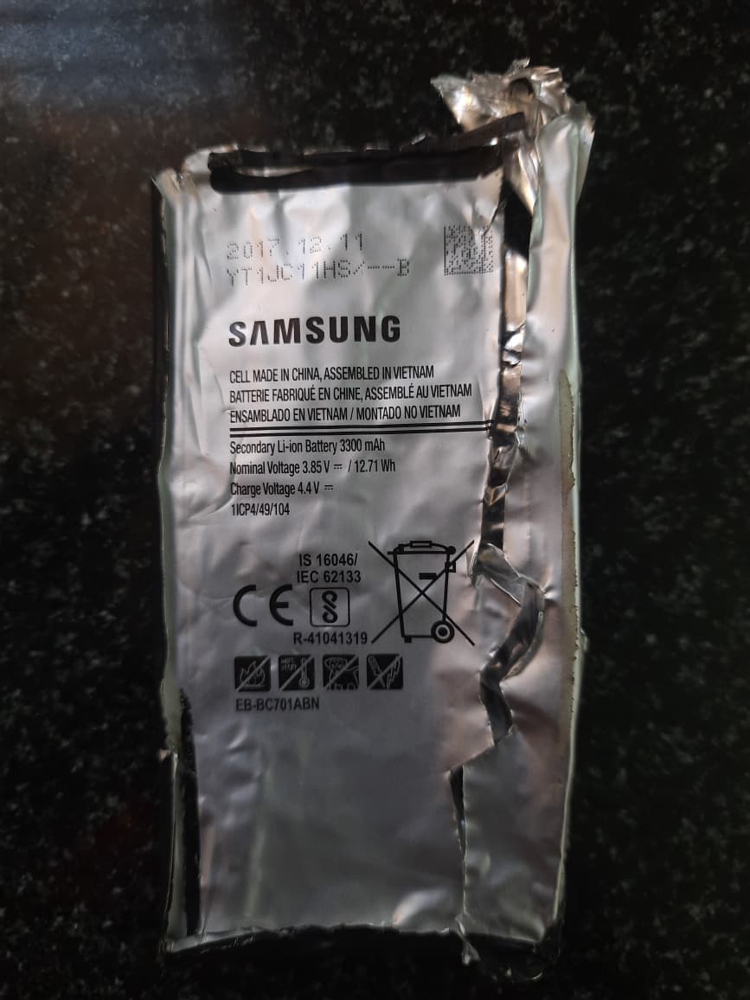
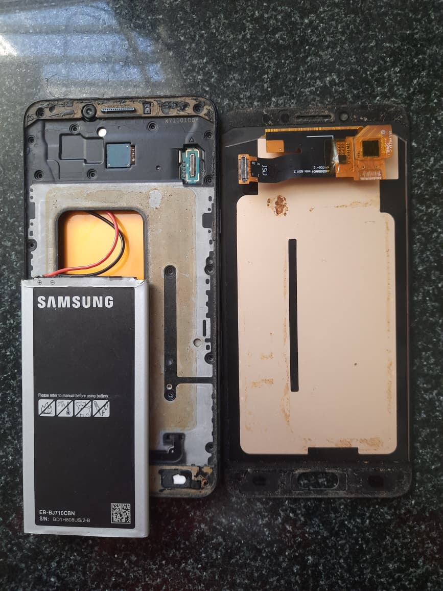
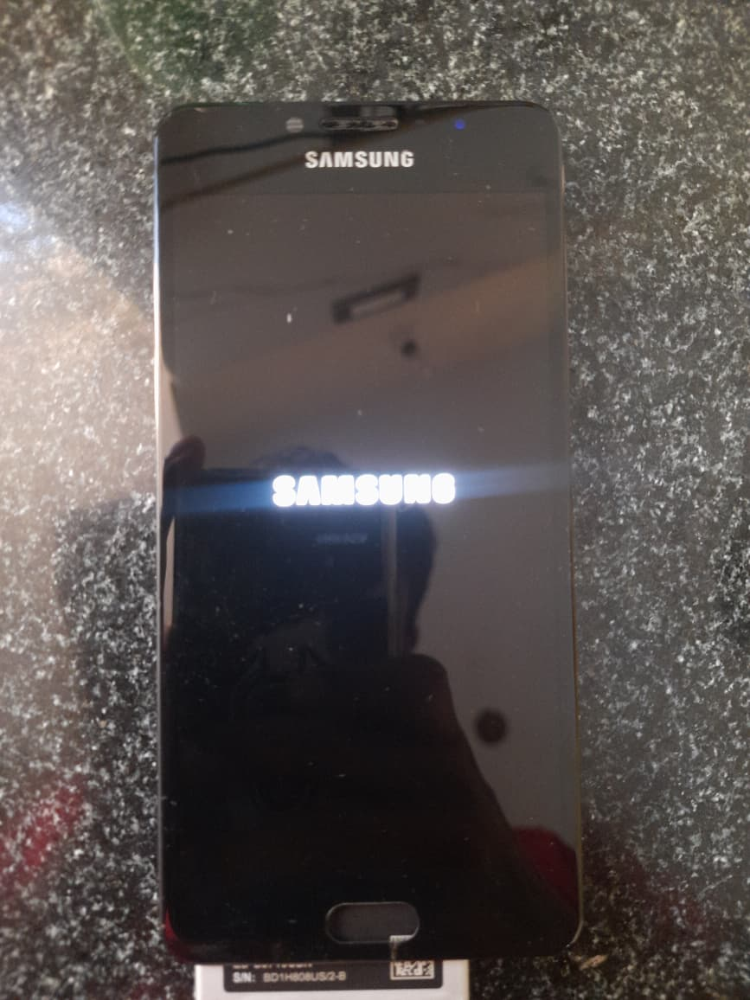
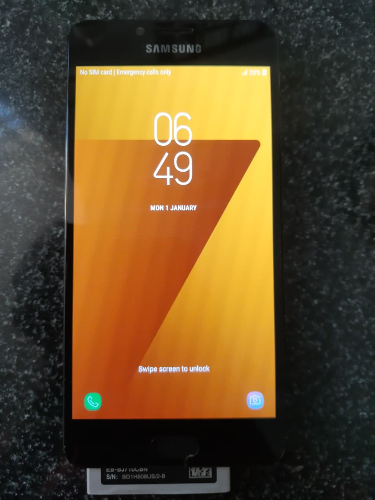

# 📱 Samsung C7 Pro Resurrection (Custom Battery Mod)

**Project Status:** Success ✅  
**Device:** Samsung Galaxy C7 Pro (SM-C701F)  
**Date:** February 2026  

## ⚠️ CRITICAL SAFETY WARNING

**PLEASE READ BEFORE ATTEMPTING SIMILAR REPAIRS:**
This project involves modifying Lithium-Ion batteries.
1.  **NEVER puncture a swollen battery:** I initially attempted to release gas from the swollen battery. **This was a mistake and is extremely dangerous.** It can lead to immediate fire or explosion. Do not attempt this.
2.  **Soldering Risks:** Soldering directly to battery terminals requires extreme caution. Overheating the cell can cause thermal runaway.
3.  **Disclaimer:** This repository is for educational purposes only. I am not responsible for damage to devices or harm to persons.

---

## 📖 The Backstory
After sitting in a drawer for over 6 years, my old Samsung C7 Pro was dead. The original battery had failed catastrophically, swelling up (becoming a "spicy pillow") and creating enough internal pressure to actually push the display assembly out of the phone chassis.

## 🛠️ The Fix: BMS Transplant

I wanted to bring the phone back to life, but I faced a problem: I couldn't find a replacement battery that fit the specific form factor and connector of the C7 Pro.

### The "Frankenstein" Solution
Since a direct replacement wasn't available, I performed a **BMS (Battery Management System) Transplant**.

1.  **Donor Battery:** I sourced a good condition Samsung battery (`EB-BJ710CBN`, typically for the J7 series). While the voltage parameters were compatible, the size and connector did not match.
2.  **Harvesting the Board:** I carefully removed the tiny PCB (protection circuit) from the original, dead C7 Pro battery (`EB-BC701ABN`).
3.  **The Bridge:** I soldered the original C7 Pro PCB to the positive and negative terminals of the donor J7 battery using two small jumper wires.
4.  **Result:** This tricked the phone into accepting the new cell using the old logic board.

## 📸 Gallery

### 1. The Damage (Swollen Battery)
*The original battery (`EB-BC701ABN`) was severely swollen. Note: The tear marks are from my failed/unsafe attempt to vent the gas.*

### 2. The Internal Mod
*You can see the custom soldering work connecting the new battery cell to the phone's original connector.*

### 3. First Boot
*The "Frankenstein" battery holds a charge and the phone passes the boot sequence.*

### 4. Back to Life
*Android OS fully loaded and functional after 6 years of inactivity.*

---

## 📝 Specifications
* **Original Battery:** EB-BC701ABN (3300 mAh)
* **Donor Battery:** EB-BJ710CBN
* **Method:** PCB/BMS Swap via wire bridging

## 📚 Project References & Resources

To successfully complete this project, I consulted various technical and safety resources. These are highly recommended for anyone interested in hardware restoration or battery management.

### 🛡️ Safety & Battery Handling (Must Read)
* **iFixit: What to do with a swollen battery** - [Read Guide](https://www.ifixit.com/Wiki/What_to_do_with_a_swollen_battery)  
    *Essential guide on identifying, handling, and disposing of "spicy pillows" safely.*
* **OSHA Lithium-ion Battery Safety Standards** - [Technical Bulletin](https://www.osha.gov/sites/default/files/publications/OSHA4480.pdf)  
    *Official safety data regarding thermal runaway and chemical hazards.*
* **NFPA Battery Safety FAQ** - [Safety Tips](https://www.nfpa.org/education-and-research/home-fire-safety/lithium-ion-batteries)  
    *Explaining why Lithium-Ion fires occur and how to prevent them.*

### 🔧 Repair Guides & Schematics
* **iFixit Samsung Galaxy C7 Pro Hub** - [Repair Manuals](https://www.ifixit.com/Device/Samsung_Galaxy_C7_Pro)  
    *Step-by-step disassembly guides for the C7 Pro series.*
* **GSMHosting Forum** - [Hardware Repair Community](https://forum.gsmhosting.com/vbb/)  
    *The world's largest community for mobile technicians discussing board-level repairs and jumpers.*
* **AllGSMTips** - [Hardware Solution Schematics](https://www.allgsmtips.com/)  
    *Useful for finding track ways and terminal pinouts for older Samsung models.*

### ⚡ BMS & Electronics Theory
* **Battery Management Systems (BMS) Overview** - [Synopsys Glossary](https://www.synopsys.com/glossary/what-is-a-battery-management-system.html)  
    *Deep dive into why the BMS is critical for cell balancing and protection.*
* **Open Battery Information (GitHub)** - [mnh-jansson/open-battery-information](https://github.com/mnh-jansson/open-battery-information)  
    *A great open-source project for understanding how to read data from various BMS boards.*

### ♻️ Sustainability & E-Waste
* **The Global E-waste Monitor** - [2024 Report](https://www.itu.int/itu-d/sites/graph/the-global-e-waste-monitor-2024/)  
    *Why repairing 6-year-old tech matters in the fight against global electronic waste.*
* **The Restart Project** - [Repair Culture](https://therestartproject.org/)  
    *A community platform dedicated to fixing our relationship with electronics.*

---
